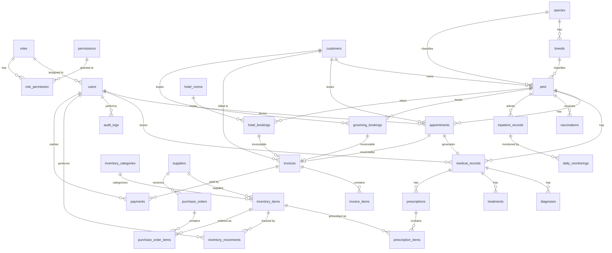

# Haland Petcare Entity Relationship Diagram

## Related Documents
- [PROJECT_SPECIFICATION.md](PROJECT_SPECIFICATION.md) — Master project specification
- [WORKFLOW.md](WORKFLOW.md) — Complete business workflows
- [DATABASE.md](DATABASE.md) — Database architecture and rules
- [BUSINESS_RULES.md](BUSINESS_RULES.md) — Centralized business rules catalog
- [GLOSSARY.md](GLOSSARY.md) — Domain terminology

---

## Overview

This document defines the complete Entity Relationship Diagram (ERD) for Haland Petcare.

The ERD is the single source of truth for:

- Database structure
- Table relationships
- Foreign keys
- Cardinality
- Delete behavior
- Index strategy
- Business rules

Every migration, model, relationship, and query must follow this document.

---

## Visual ERD

---

## Database Modules

- Identity
- Customer
- Pet
- Appointment
- Medical
- Pharmacy
- Inventory
- POS
- Grooming
- Pet Hotel
- Vaccination
- Inpatient
- Reporting
- Audit
- Settings

---

## Identity Module

### users

**PK:** id

**Relationships:**
- belongsTo role
- hasMany appointments
- hasMany medical_records
- hasMany audit_logs
- hasMany inventory_movements
- hasMany payments

**Soft Delete:** YES

---

### roles

**PK:** id

**Relationships:**
- hasMany users
- belongsToMany permissions

**Seed Data:**
- Owner
- Doctor
- Staff
- Customer

---

### permissions

**PK:** id

**Relationships:**
- belongsToMany roles

**Fields:**
- name
- guard_name
- description

---

## Customer Module

### customers

**PK:** id

**Relationships:**
- hasMany pets
- hasMany appointments
- hasMany invoices
- hasMany grooming_bookings

**Important Fields:**
- name
- phone
- email
- address
- emergency_contact

**Soft Delete:** YES

---

## Pet Module

### pets

**PK:** id

**FK:**
- customer_id
- species_id
- breed_id

**Relationships:**
- belongsTo customer
- belongsTo species
- belongsTo breed
- hasMany appointments
- hasMany medical_records
- hasMany vaccinations
- hasMany inpatient_records
- hasMany grooming_bookings
- hasMany hotel_bookings

**Important Fields:**
- name
- gender
- birth_date
- weight
- microchip_number
- photo

**Soft Delete:** YES

---

### species

**PK:** id

**Relationships:**
- hasMany breeds
- hasMany pets

**Seed:**
- Dog
- Cat
- Rabbit
- Bird
- Others

---

### breeds

**PK:** id

**FK:**
- species_id

**Relationships:**
- belongsTo species
- hasMany pets

---

## Appointment Module

### appointments

**PK:** id

**FK:**
- customer_id
- pet_id
- doctor_id

**Relationships:**
- belongsTo customer
- belongsTo pet
- belongsTo doctor
- hasOne medical_record
- morphOne invoice (as invoiceable)

**Important Fields:**
- appointment_date
- appointment_time
- status
- notes
- source (walk_in | online)

**Indexes:**
- appointment_date
- doctor_id
- status
- source

---

## Medical Module

### medical_records

**PK:** id

**FK:**
- appointment_id
- pet_id
- doctor_id

**Relationships:**
- belongsTo appointment
- belongsTo pet
- belongsTo doctor
- hasMany diagnoses
- hasMany treatments
- hasMany prescriptions

**Important Fields:**
- chief_complaint
- soap_subjective
- soap_objective
- soap_assessment
- soap_plan
- vital_sign
- doctor_note
- follow_up_date

**Soft Delete:** NO

---

### diagnoses

**PK:** id

**FK:**
- medical_record_id

**Relationships:**
- belongsTo medical_record

**Fields:**
- diagnosis_code
- diagnosis_name
- type (primary | secondary)

---

### treatments

**PK:** id

**FK:**
- medical_record_id

**Relationships:**
- belongsTo medical_record

**Fields:**
- treatment_name
- description
- cost

---

## Pharmacy Module

### prescriptions

**PK:** id

**FK:**
- medical_record_id

**Relationships:**
- belongsTo medical_record
- hasMany prescription_items

---

### prescription_items

**PK:** id

**FK:**
- prescription_id
- inventory_item_id

**Relationships:**
- belongsTo prescription
- belongsTo inventory_item

**Fields:**
- dosage
- frequency
- duration
- quantity
- instructions

---

## Inventory Module

### inventory_categories

**PK:** id

**Relationships:**
- hasMany inventory_items

**Fields:**
- name
- description

---

### inventory_items

**PK:** id

**FK:**
- supplier_id
- category_id

**Relationships:**
- belongsTo supplier
- belongsTo inventory_category
- hasMany prescription_items
- hasMany inventory_movements
- hasMany purchase_order_items

**Important Fields:**
- name
- item_type (medicine | product | supply)
- sku
- barcode
- unit
- purchase_price
- selling_price
- minimum_stock
- expired_date (nullable for non-medicine)

**Soft Delete:** YES

---

### suppliers

**PK:** id

**Relationships:**
- hasMany inventory_items
- hasMany purchase_orders

**Soft Delete:** YES

---

### purchase_orders

**PK:** id

**FK:**
- supplier_id

**Relationships:**
- belongsTo supplier
- hasMany purchase_order_items

**Fields:**
- po_number
- order_date
- expected_date
- status
- total_amount

---

### purchase_order_items

**PK:** id

**FK:**
- purchase_order_id
- inventory_item_id

**Relationships:**
- belongsTo purchase_order
- belongsTo inventory_item

**Fields:**
- quantity
- unit_price
- received_quantity
- subtotal

---

### inventory_movements

**PK:** id

**FK:**
- inventory_item_id
- performed_by (user_id)

**Relationships:**
- belongsTo inventory_item
- belongsTo user

**Fields:**
- movement_type (StockIn | StockOut | Adjustment | Purchase | Prescription | Return)
- quantity
- reference_type
- reference_id
- balance_after
- notes

**Soft Delete:** NO

---

## POS Module

### invoices

**PK:** id

**FK:**
- customer_id
- cashier_id

**Polymorphic:**
- invoiceable_type
- invoiceable_id

**Relationships:**
- belongsTo customer
- belongsTo user (cashier)
- morphTo invoiceable
- hasMany invoice_items
- hasMany payments

**Fields:**
- invoice_number
- subtotal
- discount
- tax
- grand_total
- status (Draft | Pending | Paid | Voided | Refunded)

**Indexes:**
- invoice_number
- status
- invoiceable_type
- invoiceable_id

---

### invoice_items

**PK:** id

**FK:**
- invoice_id

**Relationships:**
- belongsTo invoice

**Fields:**
- item_type (service | inventory_item)
- item_id
- description
- quantity
- unit_price
- subtotal

---

### payments

**PK:** id

**FK:**
- invoice_id
- cashier_id

**Relationships:**
- belongsTo invoice
- belongsTo user

**Fields:**
- payment_method
- amount
- reference_number
- paid_at
- status (Pending | Paid | Failed | Refunded | Voided)

**Soft Delete:** NO

---

## Grooming Module

### grooming_bookings

**PK:** id

**FK:**
- customer_id
- pet_id

**Relationships:**
- belongsTo customer
- belongsTo pet
- morphOne invoice (as invoiceable)

**Fields:**
- booking_date
- status (Booked | CheckedIn | InProgress | Completed | Cancelled)
- services
- notes

---

## Pet Hotel Module

### hotel_rooms

**PK:** id

**Relationships:**
- hasMany hotel_bookings

**Fields:**
- room_number
- room_type
- daily_rate
- capacity
- status

---

### hotel_bookings

**PK:** id

**FK:**
- room_id
- pet_id
- customer_id

**Relationships:**
- belongsTo hotel_room
- belongsTo pet
- belongsTo customer
- morphOne invoice (as invoiceable)

**Fields:**
- check_in_date
- check_out_date
- status (Reserved | CheckedIn | Active | CheckedOut | Cancelled)
- daily_rate
- notes

---

## Vaccination Module

### vaccinations

**PK:** id

**FK:**
- pet_id
- doctor_id

**Relationships:**
- belongsTo pet
- belongsTo doctor

**Fields:**
- vaccine_name
- vaccination_date
- next_due_date
- certificate_number
- batch_number

---

## Inpatient Module

### inpatient_records

**PK:** id

**FK:**
- pet_id
- doctor_id

**Relationships:**
- belongsTo pet
- belongsTo doctor
- hasMany daily_monitorings

**Fields:**
- admission_date
- discharge_date
- status (Admitted | UnderTreatment | Discharged)
- diagnosis
- notes

---

### daily_monitorings

**PK:** id

**FK:**
- inpatient_record_id

**Relationships:**
- belongsTo inpatient_record

**Fields:**
- monitored_at
- temperature
- heart_rate
- respiratory_rate
- weight
- notes

---

## Reporting Module

### reports_cache

**PK:** id

**Fields:**
- report_type
- parameters
- data
- expires_at
- created_at

---

## Audit Module

### audit_logs

**PK:** id

**FK:**
- user_id

**Relationships:**
- belongsTo user

**Fields:**
- action
- model
- model_id
- old_values
- new_values
- ip_address
- user_agent
- created_at

**Soft Delete:** NO

---

## Notification Module

### notifications

**PK:** id

**FK:**
- user_id

**Relationships:**
- belongsTo user

**Fields:**
- type
- notifiable_type
- notifiable_id
- data
- read_at
- created_at

---

## Settings Module

### settings

**Single Record Table**

**Fields:**
- clinic_name
- address
- phone
- email
- timezone
- currency
- business_hours
- payment_methods
- branding
- tax_rate

---

## Cardinality

| Entity A | Cardinality | Entity B |
|---|---|---|
| Customer | 1 → N | Pets |
| Customer | 1 → N | Appointments |
| Customer | 1 → N | Invoices |
| Customer | 1 → N | Grooming Bookings |
| Pet | 1 → N | Appointments |
| Pet | 1 → N | Medical Records |
| Pet | 1 → N | Vaccinations |
| Pet | 1 → N | Hotel Bookings |
| Pet | 1 → N | Grooming Bookings |
| Species | 1 → N | Breeds |
| Species | 1 → N | Pets |
| Breed | 1 → N | Pets |
| Appointment | 1 → 1 | Medical Record |
| Appointment | 1 → 0..1 | Invoice (polymorphic) |
| Medical Record | 1 → N | Diagnoses |
| Medical Record | 1 → N | Treatments |
| Medical Record | 1 → N | Prescriptions |
| Prescription | 1 → N | Prescription Items |
| Inventory Item | 1 → N | Prescription Items |
| Inventory Item | 1 → N | Inventory Movements |
| Inventory Item | 1 → N | Purchase Order Items |
| Inventory Category | 1 → N | Inventory Items |
| Supplier | 1 → N | Inventory Items |
| Supplier | 1 → N | Purchase Orders |
| Purchase Order | 1 → N | Purchase Order Items |
| Invoice | 1 → N | Invoice Items |
| Invoice | 1 → N | Payments |
| Grooming Booking | 1 → 0..1 | Invoice (polymorphic) |
| Hotel Booking | 1 → 0..1 | Invoice (polymorphic) |
| Hotel Room | 1 → N | Hotel Bookings |
| Inpatient Record | 1 → N | Daily Monitorings |
| Role | N → M | Permissions |
| Role | 1 → N | Users |
| User | 1 → N | Audit Logs |
| User | 1 → N | Inventory Movements |
| User | 1 → N | Payments |

---

## Delete Rules

| Entity | Delete Behavior |
|---|---|
| Customer | RESTRICT |
| Pet | RESTRICT |
| Medical Record | RESTRICT |
| Invoice | RESTRICT |
| Payment | RESTRICT |
| Audit Log | RESTRICT |
| Inventory Movement | RESTRICT |
| Supplier | SOFT DELETE |
| Inventory Item | SOFT DELETE |
| User | SOFT DELETE |
| Customer | SOFT DELETE |
| Pet | SOFT DELETE |

---

## Index Strategy

Index every:

- Foreign Key
- Polymorphic columns (`invoiceable_type`, `invoiceable_id`, `notifiable_type`, `notifiable_id`)
- Appointment Date
- Invoice Number
- Phone
- Email
- Barcode
- SKU
- Inventory Item Name
- item_type
- Payment Date
- Status Columns
- Frequently searched fields

---

## Future Expansion

The database must support future modules without structural redesign.

- Multi Clinic
- Multi Tenant
- Laboratory
- Imaging
- WhatsApp Notification
- REST API
- Mobile Application
- Accounting
- Loyalty Program
- Membership
- AI Assistant

The current architecture must remain extensible while preserving backward compatibility.

---

## Golden Rule

The database is the single source of truth.

Every workflow must preserve referential integrity, prevent duplicate data, and guarantee consistency across all related modules.